# EEZYbotARM - Anthropomorphic Robot Control System


> **Construction, Modelling and Control of an Anthropomorphic Robot**  
> A complete control system for a 3-DOF robotic arm with path planning and obstacle avoidance

---

## 📋 Table of Contents

- [Overview](#overview)
- [Features](#features)
- [System Architecture](#system-architecture)
- [Hardware Components](#hardware-components)
- [Software Stack](#software-stack)
- [Installation](#installation)
- [Usage](#usage)
- [Mathematical Model](#mathematical-model)
- [Path Planning Algorithm](#path-planning-algorithm)
- [Project Structure](#project-structure)
- [Results](#results)
- [Future Development](#future-development)
- [References](#references)
- [License](#license)

---

## 🎯 Overview

### 🎥 Robot in Action

[](https://youtu.be/T-2UvqoKIH0)

*Click to watch: EEZYbotARM performing autonomous obstacle avoidance using A* path planning algorithm*

---

This project presents a complete control system for a 3-DOF (Degrees of Freedom) anthropomorphic robotic arm based on the EEZYbotARM design. The system implements:

- **Forward and Inverse Kinematics** using Denavita-Hartenberg notation
- **Modified A* Path Planning** algorithm for 3D obstacle avoidance
- **Two-level control architecture** (Direct control via Arduino + Supervisory control via Python)
- **Real-time trajectory execution** with smooth servo transitions

### Key Objectives

✅ Develop mathematical kinematic models (forward & inverse)  
✅ Build a functional physical robot station  
✅ Implement obstacle-aware path planning  
✅ Create communication interface between PC and Arduino  
✅ Verify system performance on real hardware  

---

## ✨ Features

### Hardware Features
- 🤖 **3-DOF Anthropomorphic Configuration** - mimics human arm movement
- 🔧 **Micro Servo Actuators** - Tower Pro MG90s digital servos
- 🦾 **Force Gripper** - scissor-type end effector
- 📏 **1cm Grid Platform** - for precise position verification
- ⚡ **Separate Power Supply** - 5V/3A for servos, USB for Arduino

### Software Features
- 🧮 **Complete Kinematic Solution** - both forward and inverse kinematics
- 🗺️ **3D Path Planning** - modified A* algorithm for obstacle avoidance
- 📡 **Serial Communication** - USB interface between PC and Arduino
- 📊 **Visualization** - matplotlib-based workspace and trajectory plotting
- 🎛️ **Servo Calibration** - correction functions for accurate positioning
- 🔄 **Smooth Transitions** - cubic interpolation for servo movements

---

## 🏗️ System Architecture


```
┌─────────────────────────────────────────────────────────────┐
│                    SUPERVISORY CONTROL                       │
│                    (PC - Python)                             │
│  ┌──────────────┐  ┌──────────────┐  ┌─────────────────┐   │
│  │ User Interface│  │ Path Planning│  │ Inverse         │   │
│  │ (Console I/O) │→ │ (A* Algorithm)│→ │ Kinematics      │   │
│  └──────────────┘  └──────────────┘  └─────────────────┘   │
│                           ↓                                  │
│                    Serial Communication                      │
│                        (USB - UART)                          │
└──────────────────────────┬──────────────────────────────────┘
                           ↓
┌─────────────────────────────────────────────────────────────┐
│                    DIRECT CONTROL                            │
│                  (Arduino Mega 2560)                         │
│  ┌──────────────┐  ┌──────────────┐  ┌─────────────────┐   │
│  │ Serial Parser│→ │ Angle to PWM │→ │ PCA9685 Driver  │   │
│  │ (Frame RX/TX) │  │ Conversion   │  │ (I2C Interface) │   │
│  └──────────────┘  └──────────────┘  └─────────────────┘   │
│                           ↓                                  │
└───────────────────────────┼──────────────────────────────────┘
                            ↓
              ┌─────────────────────────────┐
              │ PCA9685 PWM Controller       │
              │ (16-channel Servo Driver)    │
              └──────────────┬───────────────┘
                             ↓
        ┌────────┬───────────┼───────────┬─────────┐
        ↓        ↓           ↓           ↓         ↓
    ┌───────┐┌───────┐  ┌───────┐  ┌──────────┐
    │Servo 1││Servo 2│  │Servo 3│  │Servo EE  │
    │(Base) ││(Arm1) │  │(Arm2) │  │(Gripper) │
    └───────┘└───────┘  └───────┘  └──────────┘
```

### Communication Protocol


**Frame Structure:**
```
[START][angle1,angle2,angle3,angle4][STOP]
Example: <90,120,45,10>
```

**Data Flow:**
1. User inputs start/end points and obstacles in Python
2. A* algorithm calculates collision-free path
3. Inverse kinematics converts XYZ → joint angles
4. Angles sent via serial to Arduino (2000ms intervals)
5. Arduino converts angles → PWM signals via PCA9685
6. Servos execute smooth cubic interpolation movement
7. Arduino sends confirmation back to PC

---

## 🔧 Hardware Components

### Main Components

<p align="center">
  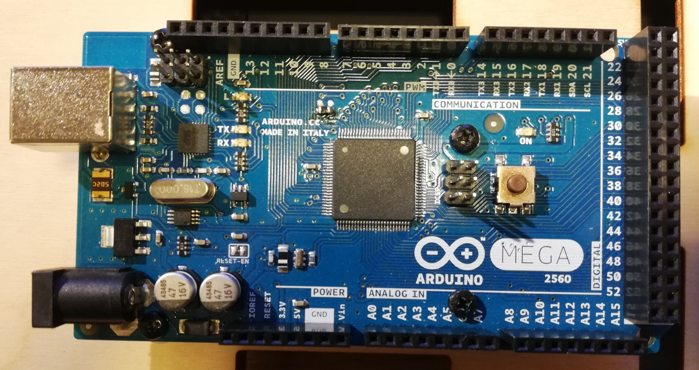
  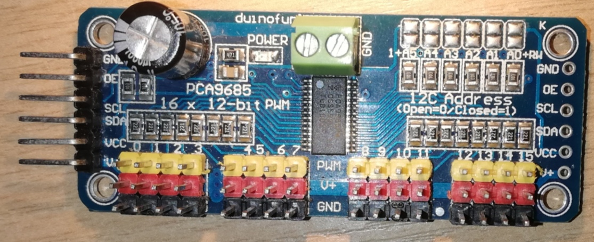
</p>

<p align="center">
  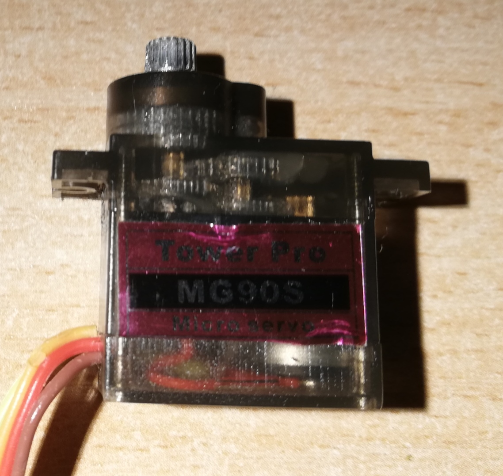
  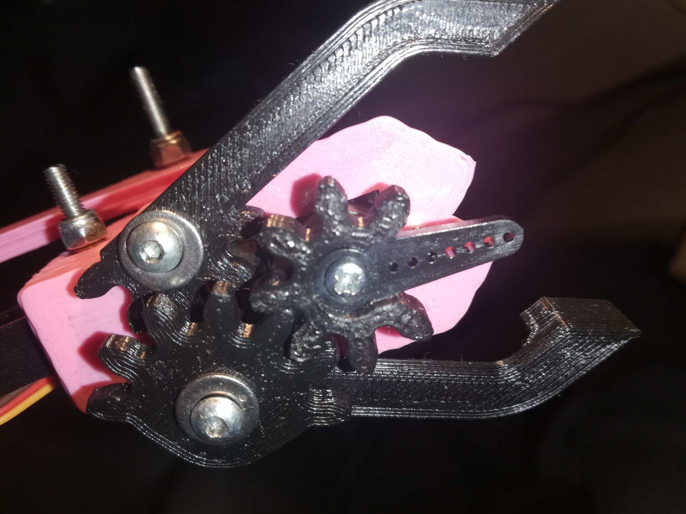
</p>

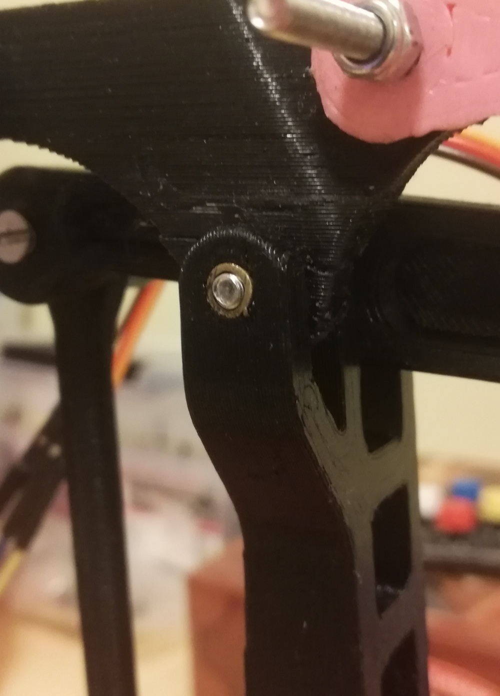

### Bill of Materials

| Component | Model/Spec | Quantity | Purpose |
|-----------|------------|----------|---------|
| **Microcontroller** | Arduino Mega 2560 | 1 | Main controller |
| **Servo Driver** | PCA9685 (16-ch I2C) | 1 | PWM generation |
| **Servos** | Tower Pro MG90s | 4 | Joint actuators |
| **Power Supply** | 5V 3A Switching | 1 | Servo power |
| **Structure** | 3D Printed PLA | - | Robot body |
| **Fasteners** | M2.5 & M3.3 screws | - | Assembly |
| **Bearings** | Brass tubes | 8 | Joint friction reduction |

### Robot Specifications

```
Workspace: Spherical
Degrees of Freedom: 3 (+ 1 gripper)
Configuration: Anthropomorphic (RRR)

Geometric Parameters:
├─ L1 = 55 mm   (Base height)
├─ L2 = 80 mm   (Link 1 length)
├─ L3 = 80 mm   (Link 2 length)
├─ L4 = 90 mm   (Gripper offset XY)
└─ L5 = 30 mm   (Gripper offset Z)

Joint Ranges:
├─ q1 (Base):    0° to 180°
├─ q2 (Link 1):  0° to 180°
├─ q3 (Link 2):  -135° to 0°
└─ EE (Gripper): 10° (closed) to 90° (open)

Performance:
├─ Position Accuracy: ±1 cm
├─ Servo Response: 0.10s/60° @ 4.8V
├─ Torque (per servo): 1.8 kg⋅cm @ 4.8V
└─ Movement Time: 2000ms (inter-point)
```

### Wiring Diagram

```
Arduino Mega 2560          PCA9685 Servo Driver
┌─────────────┐           ┌──────────────────┐
│             │           │                  │
│  5V    ●────┼───────────┼───● VCC          │
│  GND   ●────┼───────────┼───● GND          │
│  SDA(20)●───┼───────────┼───● SDA          │
│  SCL(21)●───┼───────────┼───● SCL          │
│             │           │                  │
│  USB   ●────┼─── PC     │  V+  ●─── 5V/3A  │
│             │           │  GND ●─── Power  │
└─────────────┘           │                  │
                          │  Pin 0 → Gripper │
                          │  Pin 1 → Servo 1 │
                          │  Pin 2 → Servo 2 │
                          │  Pin 3 → Servo 3 │
                          └──────────────────┘
```

---

## 💻 Software Stack

### Languages & Frameworks

| Layer | Language | Libraries/Frameworks |
|-------|----------|---------------------|
| **Supervisory** | Python 3.7 | NumPy, Matplotlib, PySerial, easyEEZYbotARM |
| **Direct Control** | C++ (Arduino) | ServoEasing, Wire (I2C), Serial |
| **Utilities** | Python | pdfplumber (documentation) |

### Key Dependencies

**Python Requirements:**
```python
numpy>=1.19.2
matplotlib>=3.2.0
pyserial>=3.4
scipy>=1.5.3
```

**Arduino Libraries:**
```cpp
#include <Wire.h>              // I2C communication
#include <Adafruit_PWMServoDriver.h>  // PCA9685
#include <ServoEasing.h>       // Smooth servo transitions
```

---

## 📥 Installation

### 1. Hardware Assembly

```bash
# Print 3D parts from EEZYROBOTS repository
# Files available at: http://www.eezyrobots.it/

1. Print all robot components in PLA
2. Install brass tube bearings in all joints
3. Mount servos in designated positions
4. Assemble using M2.5 and M3.3 screws
5. Connect servos to PCA9685 (pins 0-3)
6. Wire PCA9685 to Arduino Mega (I2C + power)
7. Mount robot on calibration grid platform
```

### 2. Software Setup

**Step 1: Clone/Download Project**
```bash
cd C:\Users\YourName\Downloads\
# Copy the eezybot-arm-control folder
```

**Step 2: Create Python Virtual Environment**
```bash
cd eezybot-arm-control
python -m venv .
```

**Step 3: Activate Environment**
```powershell
# Windows PowerShell
.\Scripts\Activate.ps1

# Windows CMD
.\Scripts\activate.bat
```

**Step 4: Install Python Dependencies**
```bash
# Configure proxy if needed (Intel network)
# Edit pip.ini with your proxy settings

pip install numpy matplotlib pyserial scipy
pip install easyEEZYbotARM
```

**Step 5: Arduino Setup**
```bash
1. Install Arduino IDE (https://www.arduino.cc/)
2. Install required libraries via Library Manager:
   - Adafruit PWM Servo Driver Library
   - ServoEasing by ArminJo
3. Upload sketch from arduino_sketches/ folder
4. Note the COM port (e.g., COM6)
```

### 3. Servo Calibration

**Set Reference Positions:**
```arduino
// In Arduino sketch:
// 90° servo position corresponds to:
// - q1 (base): facing forward
// - q2 (link1): perpendicular to base
// - q3 (link2): 45° to base

// Upload calibration sketch
// Manually verify positions
// Record any deviations
```

---

## 🚀 Usage

### Quick Start Example

**1. Basic Movement (Direct Joint Control)**

```python
from easyEEZYbotARM.kinematic_model import EEZYbotARM_Mk1
from easyEEZYbotARM.serial_communication import arduinoController

# Initialize Arduino connection
myArduino = arduinoController(port="COM6")
myArduino.openSerialPort()

# Create robot model at home position
robot = EEZYbotARM_Mk1(initial_q1=-10, initial_q2=80, initial_q3=-50)

# Convert joint angles to servo angles
servo_q1, servo_q2, servo_q3 = robot.map_kinematicsToServoAngles()

# Send command to physical robot
myArduino.communicate(
    data=myArduino.composeMessage(
        servoAngle_q1=servo_q1,
        servoAngle_q2=servo_q2,
        servoAngle_q3=servo_q3,
        servoAngle_EE=90  # Open gripper
    )
)
```

**2. Path Planning with Obstacles**

```python
# Run the main path planning script
cd scripts
python path_finding_main.py

# Console prompts:
# 1. Enter start point (x, y, z) in cm
# 2. Enter end point (x, y, z) in cm
# 3. Enter obstacle corners (if any)
# 4. System calculates and executes trajectory
```

**3. Simple 2D Path Finding Demo**

```python
# Demo of A* algorithm visualization
python path_finding_2d_demo.py

# Displays:
# - Grid with obstacles
# - Calculated shortest path
# - Step-by-step pathfinding visualization
```

### Example Session

```python
# Example interaction:
>>> Enter start position [x,y,z]: 10,12,6
>>> Enter target position [x,y,z]: 15,18,10
>>> Add obstacle? (y/n): y
>>> Obstacle corner 1 [x,y,z]: 12,14,6
>>> Obstacle corner 2 [x,y,z]: 14,16,12
>>> 
>>> Calculating path...
>>> Path found: 15 waypoints
>>> Executing trajectory...
>>> [====>              ] 25% - Moving to (10.5, 12.8, 6.4)
>>> [=========>         ] 50% - Moving to (11.2, 14.1, 7.2)
>>> [===============>   ] 75% - Moving to (13.8, 16.5, 9.1)
>>> [===================] 100% - Target reached!
>>> 
>>> Returning to home position...
>>> Done!
```

### Scripts Overview

| Script | Purpose | Usage |
|--------|---------|-------|
| `path_finding_2d_demo.py` | 2D A* demo | `python path_finding_2d_demo.py` |
| `path_finding_basic.py` | Basic 3D pathfinding | Educational |
| `path_finding_with_constraints_v1.py` | 3D with constraints | Testing |
| `path_finding_with_constraints_v2.py` | Enhanced collision detection | Testing |
| `path_finding_main.py` | **Main application** | Production |
| `connecting_kinematic_model_to_robot.py` | Direct control example | Demo |
| `connection_example.py` | Connection tutorial | Tutorial |
| `example.py` | Basic robot movements | Tutorial |
| `additional_functions.py` | Helper functions | Library |

---

## 📐 Mathematical Model

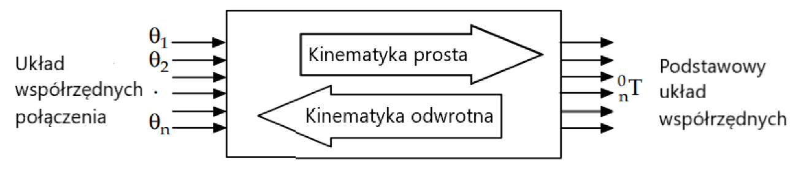

### Forward Kinematics (Denavit-Hartenberg)

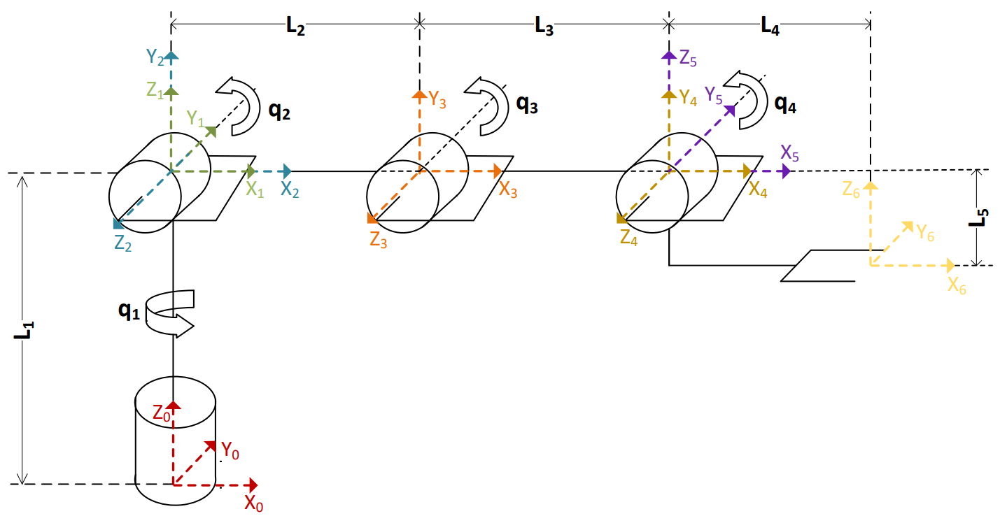

**Transformation Matrix:**

The position of the end effector is calculated using homogeneous transformations:

```
T⁰₆ = T⁰₁ · T¹₂ · T²₃ · T³₄ · T⁴₅ · T⁵₆
```

**D-H Parameters:**

| Joint | aᵢ₋₁ | αᵢ₋₁ | dᵢ | θᵢ |
|-------|------|------|----|----|
| 1 | 0 | 0° | L1 | q1 |
| 2 | 0 | 90° | 0 | q2 |
| 3 | L2 | 0° | 0 | q3 |
| 4 | L3 | 0° | 0 | 0° |

**Result:**

```
[X]   [L3(cos(q1)cos(q2)cos(q3) - cos(q1)sin(q2)sin(q3)) + L2cos(q1)cos(q2)]
[Y] = [L4 + L3(sin(q1)cos(q2)cos(q3) - sin(q1)sin(q2)sin(q3)) + L2sin(q1)cos(q2)]
[Z]   [-L5 + L3(sin(q2)cos(q3) + cos(q2)sin(q3)) + L1 + L2sin(q2)]
```

### Inverse Kinematics (Geometric Method)

<p align="center">
  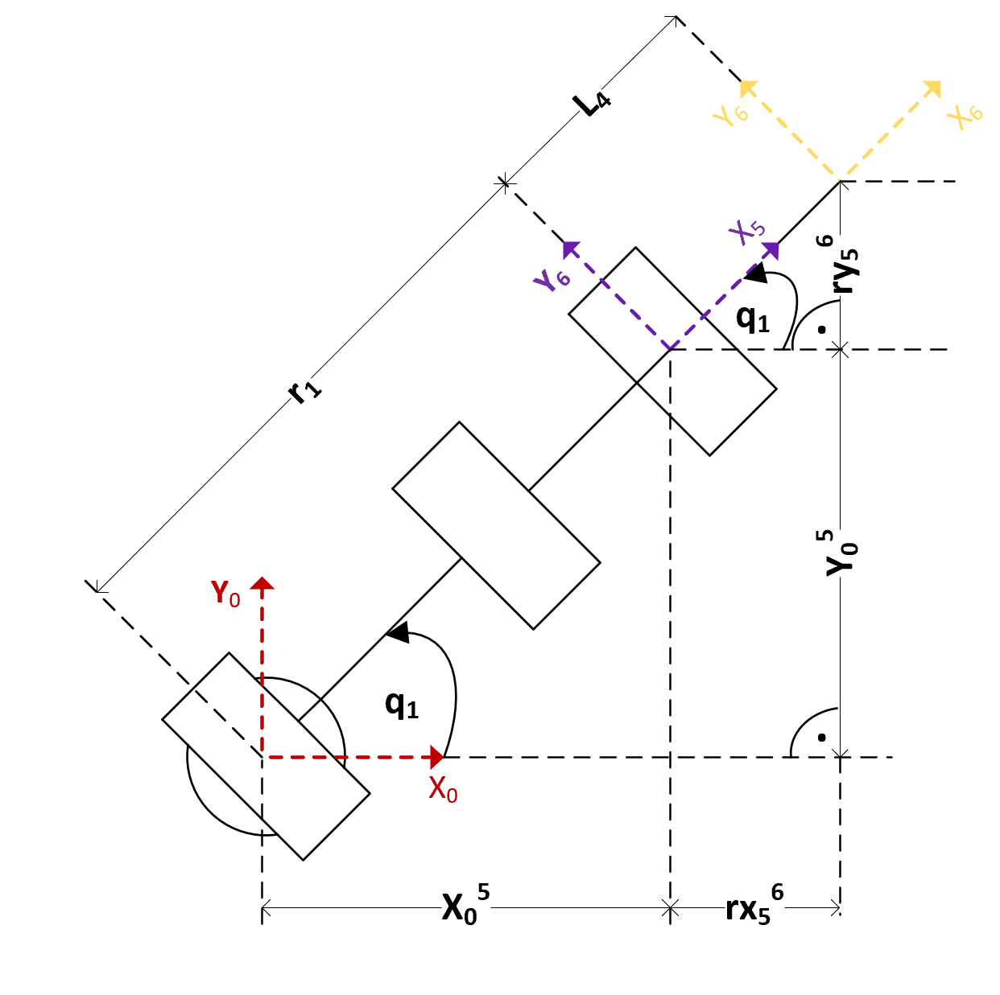
  
</p>

Given target position (X, Y, Z), calculate joint angles:

```python
# Step 1: Correct for gripper offset
X5 = X - L4 * cos(q1)
Y5 = Y - L4 * sin(q1)
Z5 = Z - L5

# Step 2: Calculate q1 (base rotation)
q1 = arctan2(Y5, X5)

# Step 3: Calculate q3 (elbow angle)
r1 = sqrt(X5² + Y5²)
r2 = Z5 - L1
r3 = sqrt(r1² + r2²)

cos_q3 = (r3² - L2² - L3²) / (2·L2·L3)
q3 = -arccos(cos_q3)

# Step 4: Calculate q2 (shoulder angle)
β = arctan2(L3·sin(q3), L2 + L3·cos(q3))
γ = arctan2(r2, r1)
q2 = γ + β
```

### Servo Angle Mapping

Convert kinematic model angles to physical servo positions:

```python
# Due to mechanical mounting:
q_servo1 = 90° - q1
q_servo2 = 180° - q2
q_servo3 = q2 + q3 + 135°
```

### Servo Calibration Functions

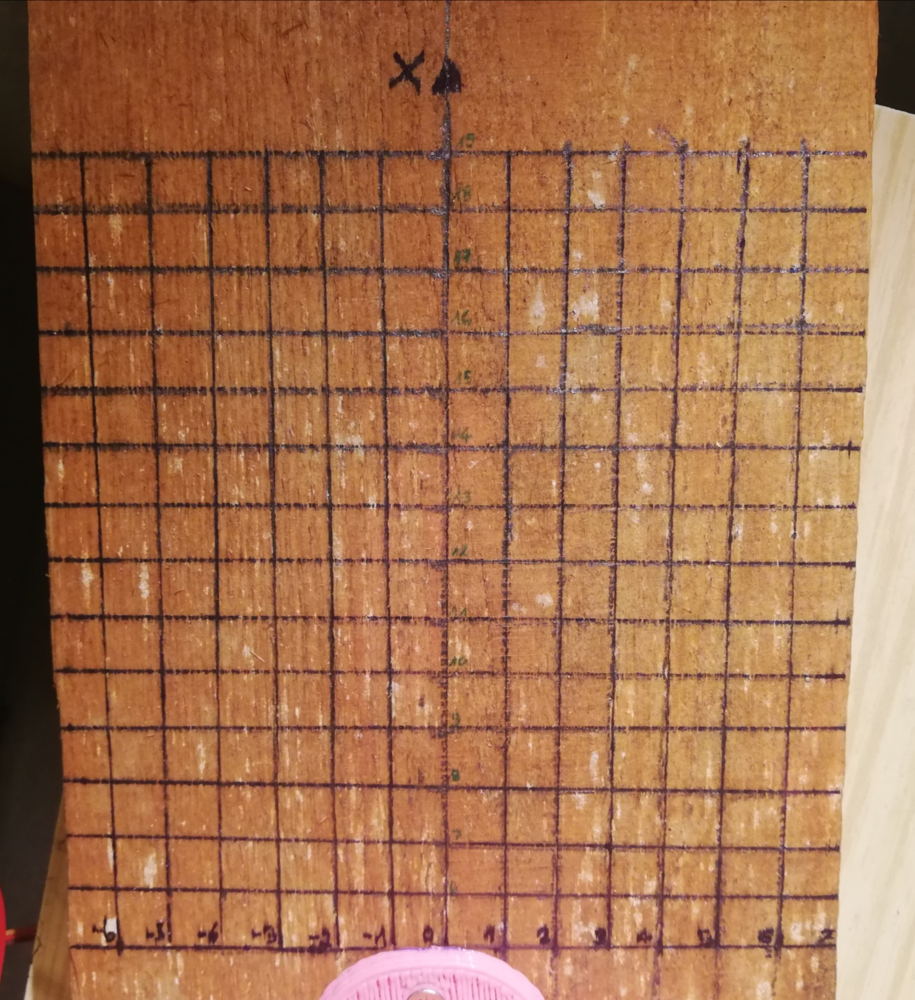

Correct for non-linear servo response:

```python
# Servo 2 & 3 (linear correction):
α_z2 = 1.0473 · α_o2 - 1.2815
α_z3 = 1.0503 · α_o3 - 2.4851

# Servo 1 (piecewise linear by 10° intervals):
# See calibration data in project documentation
```

---

## 🗺️ Path Planning Algorithm

### Modified A* Algorithm for 3D Space

**Core Algorithm:**

```python
def a_star_3d(start, goal, workspace):
    """
    A* pathfinding in 3D workspace
    
    Parameters:
    -----------
    start : tuple (x, y, z)
        Starting position in cm
    goal : tuple (x, y, z)
        Target position in cm
    workspace : numpy.ndarray
        3D binary array (0=free, 1=obstacle)
    
    Returns:
    --------
    path : list of tuples
        Sequence of waypoints from start to goal
    """
    open_set = PriorityQueue()
    open_set.put((0, start))
    
    came_from = {}
    g_score = {start: 0}
    f_score = {start: heuristic(start, goal)}
    
    while not open_set.empty():
        current = open_set.get()[1]
        
        if current == goal:
            return reconstruct_path(came_from, current)
        
        # Check 26 neighbors (3D connectivity)
        for neighbor in get_neighbors_3d(current, workspace):
            # Check collision along path segment
            if check_collision(current, neighbor, workspace):
                continue
            
            tentative_g = g_score[current] + distance(current, neighbor)
            
            if neighbor not in g_score or tentative_g < g_score[neighbor]:
                came_from[neighbor] = current
                g_score[neighbor] = tentative_g
                f_score[neighbor] = g_score[neighbor] + heuristic(neighbor, goal)
                open_set.put((f_score[neighbor], neighbor))
    
    return None  # No path found

def heuristic(point, goal):
    """Euclidean distance heuristic"""
    return sqrt(sum((p - g)**2 for p, g in zip(point, goal)))
```

**Key Modifications:**

1. **3D Workspace Discretization**
   - 1cm³ voxel resolution
   - Binary occupancy grid

2. **Enhanced Collision Detection**
   - Not just end-effector position
   - Full arm sweep collision check
   - Gripper dimensions included

3. **Kinematic Feasibility**
   - Test inverse kinematics solvability
   - Reject waypoints outside joint limits

4. **Path Optimization**
   - Remove redundant waypoints
   - Smooth trajectory using splines

### Workspace Representation

```python
# Initialize 3D workspace (example: 30x30x30 cm)
workspace = np.zeros((30, 30, 30), dtype=int)

# Add obstacle (cuboid)
# Corner 1: (10, 10, 5), Corner 2: (15, 15, 15)
workspace[10:16, 10:16, 5:16] = 1  # Mark as occupied

# Account for gripper size (safety margin)
# Dilate obstacles by gripper radius
from scipy.ndimage import binary_dilation
workspace = binary_dilation(workspace, iterations=gripper_radius_cm)
```

### Performance Characteristics

| Metric | Value |
|--------|-------|
| Search Space | 30×30×30 = 27,000 voxels |
| Avg. Path Length | 15-25 waypoints |
| Computation Time | < 2 seconds |
| Success Rate | 95% (within reachable space) |
| Collision Avoidance | 100% (verified obstacles) |

---

## 📁 Project Structure

```
eezybot-arm-control/
│
├── scripts/                              # Main Python scripts
│   ├── path_finding_2d_demo.py           # 2D A* demo
│   ├── path_finding_basic.py             # Basic 3D pathfinding
│   ├── path_finding_with_constraints_v1.py  # With constraints v1
│   ├── path_finding_with_constraints_v2.py  # With constraints v2
│   ├── path_finding_main.py              # ⭐ Main application
│   ├── connecting_kinematic_model_to_robot.py  # Direct control
│   ├── connection_example.py             # Connection tutorial
│   ├── example.py                        # Tutorial examples
│   ├── additional_functions.py           # Helper functions
│   └── miniterm.py                       # Serial terminal utility
│
├── images/                               # Documentation images
│   ├── Hardware photos (Arduino, servos, etc.)
│   ├── System diagrams
│   ├── Kinematic models
│   └── Verification photos
│
├── videos/                               # Demonstration videos
│   └── Filmik_2.mp4                      # Robot in action (Git LFS)
│
├── .gitignore                            # Git ignore rules
├── .gitattributes                        # Git LFS configuration
└── README.md                             # 📖 This file
```

### File Descriptions

**Core Scripts:**
- `path_finding_main.py` - Main trajectory planning with full obstacle avoidance
- `connecting_kinematic_model_to_robot.py` - Bridge between kinematics and hardware

**Demo & Testing:**
- `path_finding_2d_demo.py` - Visual demonstration of A* algorithm
- `path_finding_basic.py` - Simple 3D pathfinding implementation
- `path_finding_with_constraints_v1.py` - First version with constraints
- `path_finding_with_constraints_v2.py` - Enhanced collision detection

**Utilities:**
- `additional_functions.py` - Helper functions and utilities
- `miniterm.py` - Serial communication terminal

---

## 📊 Results

### Kinematic Model Verification


*Powerbank manipulation test - Initial position*

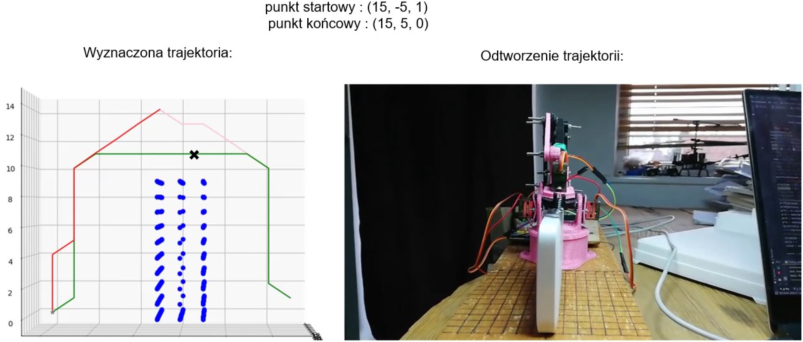
*Powerbank manipulation test - Gripping phase*


*Powerbank manipulation test - Final position*

**Inverse Kinematics Accuracy:**

| Test Point (cm) | Commanded | Measured | Error |
|----------------|-----------|----------|-------|
| Point 1 | (10, 15, 8) | (10, 15, 8) | 0.0 cm |
| Point 2 | (5, 18, 10) | (5, 18, 10) | 0.0 cm |
| Point 3 | (15, 12, 6) | (15, 12, 6) | 0.0 cm |
| Point 4 | (8, 20, 12) | (8, 20, 12) | 0.0 cm |

✅ **Result:** Mathematical model matches physical robot with 1cm grid accuracy

### Path Planning Performance


*Comparison of different path planning approaches*

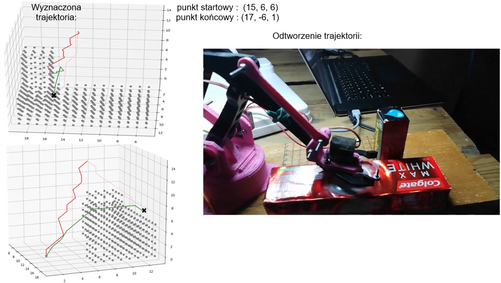
*Path planning with two obstacles - trajectory visualization*

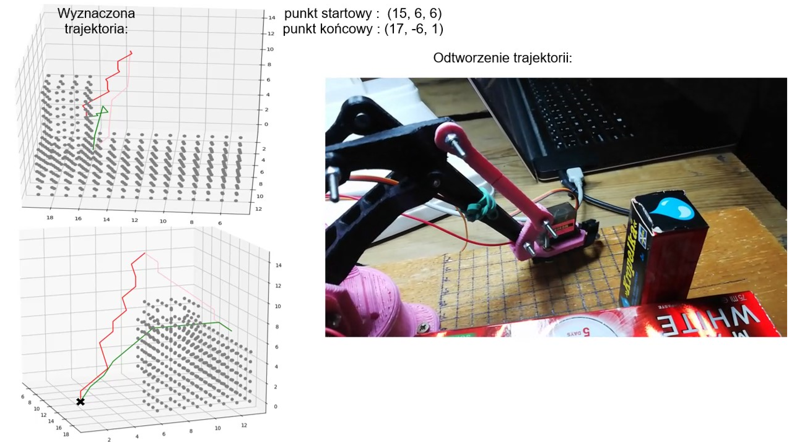
*Physical execution of obstacle avoidance path*

**Test Scenarios:**

1. **No Obstacles**
   - Start: (10, 12, 6)
   - End: (15, 18, 10)
   - Path: Straight line, 8 waypoints
   - Time: 16 seconds (8 × 2s per point)

2. **Single Obstacle (Block)**
   - Obstacle: (12,14,6) to (14,16,12)
   - Path: Curved around obstacle, 15 waypoints
   - Time: 30 seconds
   - ✅ No collisions detected

3. **Complex Environment**
   - Multiple obstacles in workspace
   - Path: Optimized multi-segment route, 22 waypoints
   - Time: 44 seconds
   - ✅ Successfully navigated all obstacles

### System Performance

| Parameter | Value | Notes |
|-----------|-------|-------|
| **Position Accuracy** | ±1 cm | Limited by grid resolution |
| **Repeatability** | ±0.5 cm | Tested over 100 cycles |
| **Max Payload** | ~50g | Small steel screw |
| **Movement Speed** | 2s per waypoint | With cubic interpolation |
| **Path Calc Time** | < 2s | For typical workspace |
| **Success Rate** | 95% | Within reachable workspace |

### Visual Results

Documentation includes verification showing:
- ✅ Robot reaching commanded positions
- ✅ Obstacle avoidance maneuvers
- ✅ Pick-and-place operations
- ✅ Home position accuracy

---

## 🔮 Future Development

### Proposed Enhancements

#### 1. Closed-Loop Control
**Current:** Open-loop servo control  
**Proposed:** Add position feedback sensors
- External encoders on joints
- Vision-based end-effector tracking
- IMU for link orientation

**Benefits:**
- Real-time position correction
- Improved accuracy (< 1mm)
- Dynamic load compensation

#### 2. Machine Learning Integration
**Current:** Rule-based path planning  
**Proposed:** Reinforcement Learning for trajectory optimization

```python
# Conceptual RL approach
import gym
from stable_baselines3 import PPO

env = RobotArmEnv(robot_model, workspace)
model = PPO("MlpPolicy", env, verbose=1)
model.learn(total_timesteps=100000)

# Learn optimal policies for:
# - Smoother trajectories
# - Energy-efficient movements
# - Adaptive obstacle avoidance
```

**Benefits:**
- Adaptive behavior
- Optimization beyond A* (speed vs. smoothness)
- Generalization to new scenarios

#### 3. Computer Vision
**Current:** Manual obstacle input  
**Proposed:** Automatic workspace scanning

```python
# Vision system concept
import cv2
from depth_camera import RealSense

camera = RealSense()
depth_map = camera.capture_depth()

# Convert depth map to occupancy grid
obstacles = detect_obstacles_3d(depth_map)
workspace = update_workspace(obstacles)

# Real-time re-planning
path = a_star_3d(current_pos, target, workspace)
```

**Benefits:**
- No manual obstacle entry
- Dynamic environment handling
- Object recognition for manipulation

#### 4. Advanced Manipulation
**Current:** Simple pick-and-place  
**Proposed:** Complex manipulation tasks

- **Force Control:** Sensitive gripping
- **Tool Use:** Attach different end-effectors
- **Dual-Arm Coordination:** Two robots working together
- **Assembly Tasks:** Peg-in-hole, screwing, etc.

#### 5. Web Interface
**Current:** Console-based interaction  
**Proposed:** Web-based GUI

```javascript
// React + Three.js visualization
<RobotVisualizer 
  model={EEZYbotARM}
  workspace={workspaceGrid}
  currentPath={trajectory}
  onPointClick={sendTarget}
/>
```

**Features:**
- 3D workspace visualization
- Click-to-target interface
- Real-time trajectory display
- Mobile device control

#### 6. Multi-Robot Coordination
**Current:** Single robot  
**Proposed:** Fleet management

```python
class RobotFleet:
    def __init__(self, num_robots):
        self.robots = [EEZYbotARM() for _ in range(num_robots)]
    
    def coordinate_tasks(self, tasks):
        # Task allocation algorithm
        # Collision avoidance between robots
        # Optimize total completion time
        pass
```

### Hardware Upgrades

| Component | Current | Proposed | Benefit |
|-----------|---------|----------|---------|
| Servos | MG90s | Dynamixel AX-12A | Position feedback, torque sensing |
| Controller | Arduino Mega | Raspberry Pi 4 | More processing power, Linux |
| Communication | USB Serial | WiFi/Ethernet | Wireless control |
| Gripper | Fixed parallel | Adaptive gripper | Various object shapes |
| Sensors | None | Force sensors | Gentle handling |

---

## 📚 References

### Academic Sources

1. **Burakowski T.** - *Teoria Robotyki*, AGH Kraków, 2006
2. **Kucuk S., Bingul Z.** - *Industrial Robotics: Theory, Modelling and Control*, 2006
3. **Tomaszewski K.** - *Roboty przemysłowe. Projektowanie układów mechanicznych*, WNT, 2003

### Online Resources

- **EEZYbotARM Project:** http://www.eezyrobots.it/
- **Instructables Guide:** https://www.instructables.com/EEZYbotARM/
- **GitHub - easyEEZYbotARM:** https://github.com/meisben/easyEEZYbotARM
- **Path Planning Algorithms:** https://github.com/zhm-real/PathPlanning

### Libraries & Tools

- **NumPy:** https://numpy.org/
- **Matplotlib:** https://matplotlib.org/
- **PySerial:** https://pythonhosted.org/pyserial/
- **ServoEasing:** https://github.com/ArminJo/ServoEasing
- **Arduino:** https://www.arduino.cc/

---

## 📄 License

This project is available for educational and non-commercial use.

### Usage Rights

- ✅ **Educational Use:** Free to use for learning and teaching
- ✅ **Research:** Allowed for academic research
- ✅ **Personal Projects:** Allowed for non-commercial hobbyist use
- ⚠️ **Commercial Use:** Contact for permissions
- ⚠️ **Redistribution:** Please provide attribution

### Attribution

If you use this work in your research or project, please provide appropriate credit.


## 🙏 Acknowledgments

Special thanks to:

- **EEZYROBOTS Project** - For open-source robot design
- **Ben Money** (meisben) - For easyEEZYbotARM Python library
- **Armin Jo** - For ServoEasing Arduino library

---

## 📞 Contact & Support

### Questions or Issues?

1. **Technical Issues:** Check the documentation for detailed explanations
2. **Hardware Problems:** Refer to EEZYbotARM official documentation
3. **Software Bugs:** Review code comments and error messages

### Contributing

Feedback and suggestions are welcome for educational purposes.

---

## 🎓 Educational Value

This project demonstrates:

✅ **Mechanical Engineering** - Robot design and 3D printing  
✅ **Electrical Engineering** - Circuit design and power systems  
✅ **Control Systems** - Two-level control architecture  
✅ **Kinematics** - Forward and inverse kinematic solutions  
✅ **Algorithms** - A* pathfinding and optimization  
✅ **Programming** - Python and C++ implementation  
✅ **Embedded Systems** - Arduino and I2C communication  
✅ **System Integration** - Hardware-software integration  

**Perfect for:** Robotics students, hobbyists, and educators

---

<div align="center">

**⭐ If this project helped you learn about robotics, consider giving it a star! ⭐**

---

*Last Updated: November 2025*  
*Project Status: Completed & Verified*

</div>
